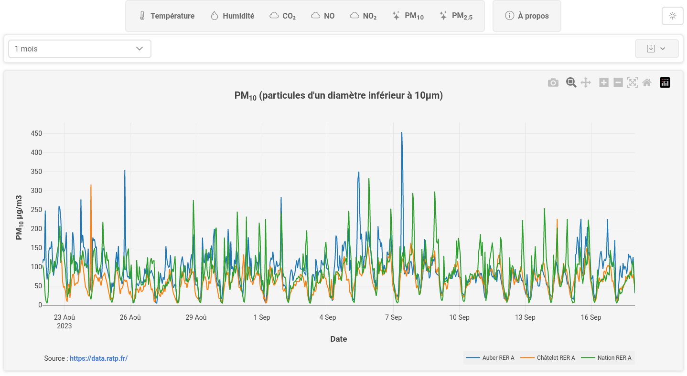

# rer-air-quality

  
   
  <b><a href="https://jldblog.github.io/rer-air-quality/" target="_blank">https://jldblog.github.io/rer-air-quality/</a></b>

### Introduction

La <a href="https://www.ratp.fr/" target="_blank">RATP</a> propose sur son site
<a href="https://data.ratp.fr/" target="_blank">Open Data RATP</a>
des données ouvertes sur la qualité de l'air mesurée dans les stations souterraines Auber, Châtelet,
Châtelet RER A, Franklin D. Roosevelt et Nation.

Le site <a href="https://data.ratp.fr/" target="_blank">Open Data RATP</a> explique que :

> _Le laboratoire de la RATP réalise des mesures, en continu, dans 5 stations représentatives des espaces souterrains de la RATP (Châtelet, Franklin Roosevelt et Auber, Châtelet RER A et Nation RER A) qui constituent le réseau SQUALES (Surveillance de la Qualité de l'Air de l'Environnement Souterrain)._
>
> _Les mesures portent sur les paramètres climatiques usuels (température, humidité relative), le renouvellement d’air (dioxyde de carbone) et la qualité de l’air (oxydes d‘azote, particules)._

### L'application

Cette application exploite les données ouvertes sur sur la qualité de l'air mesurée dans 3 stations RER (Auber, Châtelet & Nation).

L'application est développée avec le framework <a href="https://angular.io/" target="_blank">Angular 17</a>,
la libraire de composants <a href="https://primeng.org/" target="_blank">PrimeNG 17</a> ainsi que
<a href="https://plotly.com/javascript/" target="_blank">Plotly</a> pour le rendu des graphiques.

Le code source est disponible sur <a href="https://github.com/jldblog/rer-air-quality/" target="_blank">GitHub</a> sous licence
<a href="https://www.gnu.org/licenses/gpl-3.0.en.html" target="_blank">GNU GPLv3</a>.

Ce projet n'est pas lié au groupe RATP.

### Démo

La démo de l'application est en ligne sur GitHub ici : <a href="https://jldblog.github.io/rer-air-quality/" target="_blank">https://jldblog.github.io/rer-air-quality/</a>.

### Les données

Le jeu de données hebdomadaires comprend pour toutes les stations les moyennes horaires pour :

- Température ambiante en °C
- Humidité relative en %

Et selon les stations :

- CO2 en ppm (Auber)
- NO en μg/m3 (Auber)
- NO2 en μg/m3 (Auber)
- PM10 en μg/m3 (Auber, Châtelet & Nation)
- PM2,5 en μg/m3 (Auber & Nation)

Voici quelques liens utiles pour comprendre les mesures de qualité d'air :

- sur C0 et C02 : <a href="https://www.airparif.asso.fr/monoxyde-de-carbone-co" target="_blank">https://www.airparif.asso.fr/monoxyde-de-carbone-co</a>
- sur NO2 : <a href="https://www.airparif.asso.fr/le-dioxyde-dazote" target="_blank">https://www.airparif.asso.fr/le-dioxyde-dazote</a>
- sur PM10 et PM2,5 :
  - <a href="https://www.airparif.asso.fr/les-particules" target="_blank">https://www.airparif.asso.fr/les-particules</a>
  - <a href="https://fr.wikipedia.org/wiki/Particules_en_suspension" target="_blank">https://fr.wikipedia.org/wiki/Particules_en_suspension</a>

### Galerie

#### Température sur 2 semaines

  

#### Humidité sur 2 semaines

  

#### PM10 sur 1 mois

  

#### PM2.5 sur 1 mois en mode sombre

  

### Références

- <a href="https://data.ratp.fr/explore/dataset/qualite-de-lair-mesuree-dans-la-station-auber/information/" target="_blank">Qualité de l'air mesurée dans la station Auber</a>
- <a href="https://data.ratp.fr/explore/dataset/qualite-de-lair-mesuree-dans-la-station-chatelet-rer-a0/information/" target="_blank">Qualité de l'air mesurée dans la station Châtelet RER A</a>
- <a href="https://data.ratp.fr/explore/dataset/qualite-de-lair-mesuree-dans-la-station-nation-rer-a0/information/" target="_blank">Qualité de l'air mesurée dans la station Nation RER A</a>
- <a href="https://help.opendatasoft.com/apis/ods-explore-v2/explore_v2.1.html" target="_blank">API Opendatasoft</a>
- <a href="https://www.etalab.gouv.fr/wp-content/uploads/2014/05/Licence_Ouverte.pdf" target="_blank">Licence des données</a>
- <a href="https://air-interieur.ratp.fr/" target="_blank">La qualité de l’air dans les gares & stations</a>
